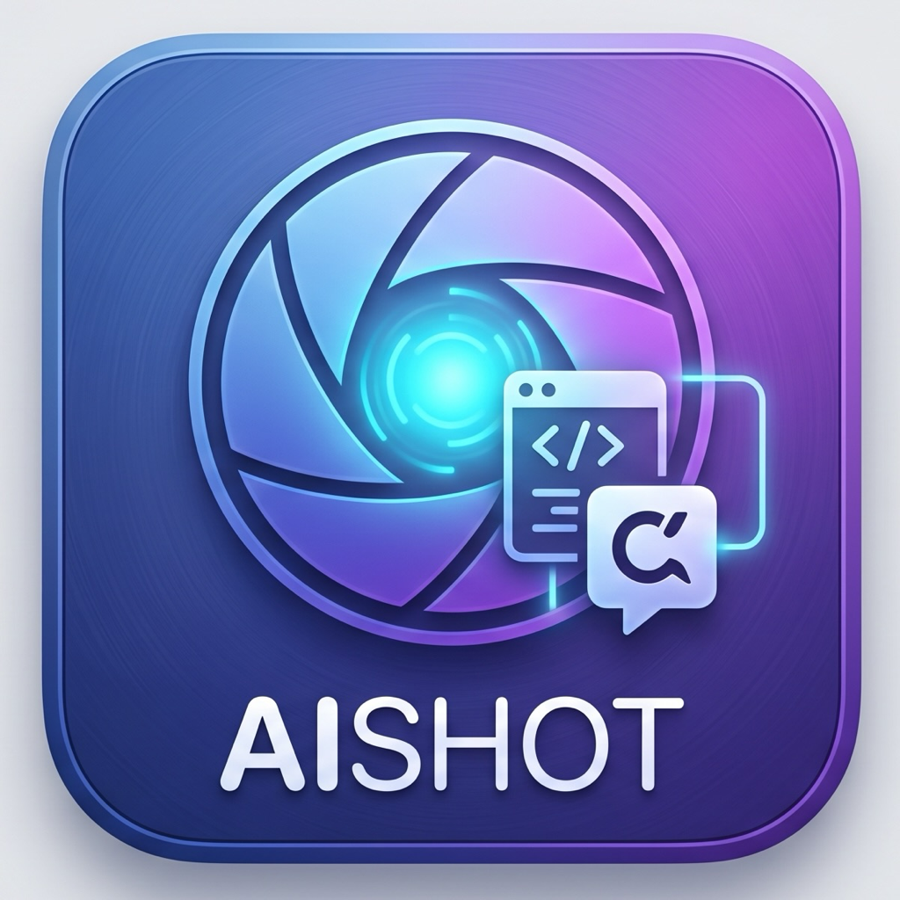

<p align="center">
  
</p>

<h1 align="center">AIShot</h1>

<p align="center">
  단축키 한 번: 스크린샷 → <b>지금 대화 중인 AI 앱에 바로</b>.<br>
  <i>Finder 뒤지기 없음 · 드래그&드롭 없음 · 상주 프로세스 없음</i>
</p>

<p align="center"><a href="README.md">English</a></p>

---

단축키 → 영역 드래그(<kbd>Space</kbd>로 창 선택, <kbd>Esc</kbd> 취소) → PNG가
기존 스크린샷 폴더에 저장되는 **동시에**, 단축키를 누른 순간 최전면에 있던
앱으로 들어간다:

| 최전면 앱 | 붙여넣는 것 | 이유 |
|---|---|---|
| 터미널·IDE — Ghostty, Terminal, iTerm2, kitty, WezTerm, Warp, VS Code, Antigravity, Cursor | 이스케이프된 **파일 경로** + 자동 ⌘V | Claude Code·Codex CLI는 경로로 이미지를 읽음 (드래그&드롭과 같은 형식) |
| AI 앱·브라우저 — Claude, Codex, ChatGPT, Gemini, Safari, Chrome | **PNG 이미지** + 자동 ⌘V | 채팅 입력창에 이미지로 첨부 |
| 그 외 모든 앱 | 클립보드 복사만 (자동 ⌘V 없음) | 엉뚱한 곳에 붙는 사고 방지 — 원하는 곳에서 직접 ⌘V |

모든 캡처는 macOS 기본 파일명(`Screenshot 2026-07-08 at 11.09.27 AM.png`)의
**파일로도 저장**되므로 붙여넣기와 아카이빙이 한 동작에 끝난다.
저장 폴더는 이 순서로 결정된다:

1. `--out DIR` 플래그
2. 앱 자체 설정 — 내장 폴더 선택창으로 지정:
   ```sh
   open -na AIShot --args --choose-dir
   ```
   (또는 `defaults write com.techjuicelab.aishot saveDir "~/원하는/폴더"`)
3. 시스템 스크린샷 폴더 (`com.apple.screencapture location`)
4. `~/Desktop` (macOS 기본값)

AIShot은 **호출될 때만 실행**된다 — 캡처하고, 붙여넣고, 종료.
메뉴 막대 아이콘도, 데몬도 없고, 대기 중 점유율은 0이다.

## 설치

**소스에서 빌드** (Xcode Command Line Tools 필요):

```sh
git clone https://github.com/techjuicelab/aishot.git
cd aishot && ./build.sh   # 빌드 → 애드혹 서명 → ~/Applications 설치
```

또는 [Releases](https://github.com/techjuicelab/aishot/releases)에서
`AIShot.app.zip`을 받아 `~/Applications`에 풀기. 브라우저 다운로드는 격리되므로
첫 실행 때 한 번 우클릭 → 열기.

## 단축키

쓰고 있는 런처 아무거나 아래 명령에 연결:

```sh
open -gn "$HOME/Applications/AIShot.app"
```

- **Karabiner-Elements**: [`karabiner/aishot.json`](karabiner/aishot.json)을
  `~/.config/karabiner/assets/complex_modifications/`에 복사한 뒤
  Karabiner-Elements → Complex Modifications → Add rule에서 "AIShot" 활성화.
  기본 키는 <kbd>⌘⇧2</kbd> — 시스템 ⌘⇧3/4/5 스크린샷 패밀리 옆자리.
- **Alfred / Raycast / 단축어 앱**: 같은 `open` 명령에 핫키 지정.

## 첫 실행 권한 (한 번만)

1. 첫 단축키 → **화면 기록** 프롬프트가 뜨고 앱은 캡처 없이 종료
   (시스템 설정 → 개인정보 보호 및 보안 → 화면 및 시스템 오디오 기록 → AIShot 허용).
2. 다시 단축키 → 캡처 UI. 저장 시점에 스크린샷 폴더(iCloud Drive/데스크탑)에 대한
   **파일 및 폴더** 프롬프트가 나올 수 있다 — 거부하면 저장이 안 되니 허용.
3. 첫 캡처 완료 후 → **손쉬운 사용** 프롬프트(자동 ⌘V용). 허용 전에는 클립보드
   복사까지만 동작하고, 허용한 다음 샷부터 자동 붙여넣기.

**재빌드 주의**: 애드혹 서명이라 재빌드하면 코드 해시가 바뀌어 기존 TCC 권한이
조용히 무효화된다 — 시스템 설정 토글은 켜져 보이지만 실제로는 무효(창 내용 없이
배경화면만 찍히는 증상). 그래서 `build.sh`가 설치 후
`tccutil reset All com.techjuicelab.aishot`을 실행해 다음 실행에서 프롬프트가
다시 뜨게 한다. 자주 재빌드한다면 키체인 접근 → 인증서 지원에서 코드 서명용
자체 서명 인증서를 만들어 `codesign` 라인을 바꾸면 권한이 빌드를 넘어 유지된다.

## 플래그

```sh
open -gn "$HOME/Applications/AIShot.app" --args --mode image
```

| 플래그 | 설명 | 기본값 |
|---|---|---|
| `--mode auto\|path\|image` | 자동 감지 대신 붙여넣기 형식 강제 | `auto` |
| `--out DIR` | 저장 폴더 (이번 실행만) | 위 저장 폴더 순서 참고 |
| `--choose-dir` | 폴더 선택창을 열어 앱 기본 저장 폴더로 저장 | — |
| `--no-paste` | 클립보드 복사까지만, 자동 ⌘V 안 함 | — |
| `--timeout SEC` | 선택 UI 대기 시간 | `300` |
| `--self-test` | 폴더·최전면 앱·권한 상태만 출력하고 종료 | — |

## 커스터마이즈

**재빌드 없이** 앱 분류 추가 — AIShot은 실행 시 `defaults` 배열 두 개를 읽는다:

```sh
# 앱의 번들 ID 확인
osascript -e 'id of app "SomeTerm"'

defaults write com.techjuicelab.aishot extraPathApps  -array-add "com.example.someterm"
defaults write com.techjuicelab.aishot extraImageApps -array-add "com.example.chatapp"
```

또는 [`main.swift`](main.swift) 상단의 `pathPasteIDs` / `imagePasteIDs`를
수정하고 `./build.sh` 재실행.

## 제거

```sh
rm -rf ~/Applications/AIShot.app
tccutil reset All com.techjuicelab.aishot
defaults delete com.techjuicelab.aishot 2>/dev/null
# 런처/Karabiner에서 핫키 룰 제거
```

로그: `/tmp/aishot.log`

## 라이선스

[MIT](LICENSE) © TechJuiceLab
