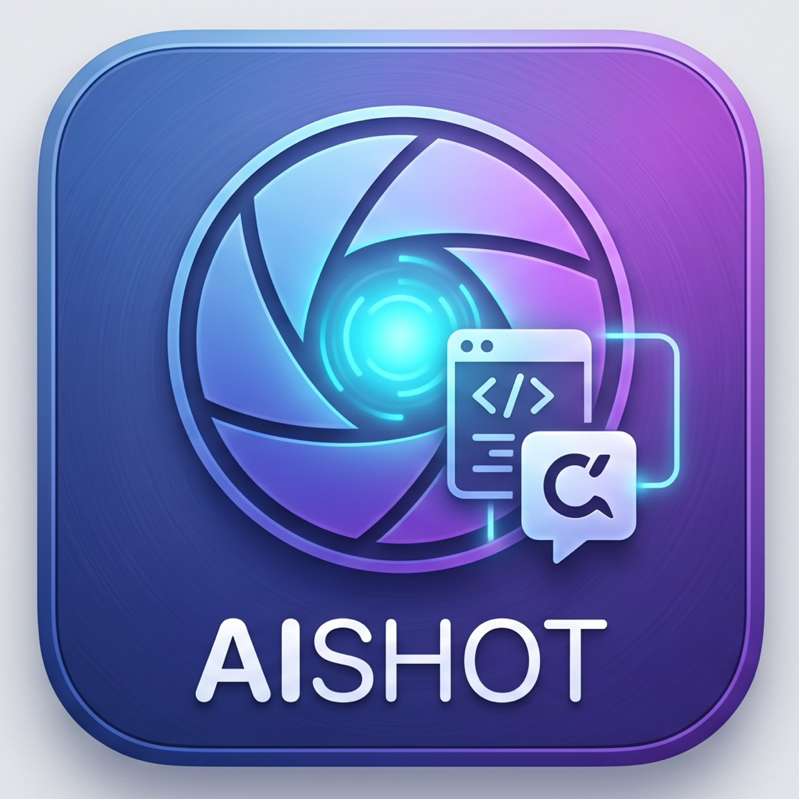

<p align="center">
  
</p>

<h1 align="center">AIShot</h1>

<p align="center">
  One hotkey: screenshot → <b>straight into the AI app you're talking to</b>.<br>
  <i>No Finder digging · no drag &amp; drop · quick destinations in the menu bar</i>
</p>

<p align="center"><a href="README.ko.md">한국어</a></p>

---

Press a hotkey → drag a region (or hit <kbd>Space</kbd> for a window, <kbd>Esc</kbd>
to cancel) → the PNG is saved into your usual screenshot folder **and** handed
to the destination you chose from the [menu bar or Settings](#menu-bar):

| Destination setting | Where every capture goes | What gets pasted |
|---|---|---|
| A specific app — Claude, Antigravity, ChatGPT, Codex, or any other app | that app, regardless of what was frontmost; AIShot opens it when needed by default | configurable: **Automatic**, **PNG image**, or **File path** |
| A terminal — Ghostty, iTerm2, Terminal, WezTerm, kitty, Warp | the CLI agent you keep open there — Claude Code, Codex CLI, Gemini CLI — in whichever window, tab and split the terminal itself last had focused | escaped **file path** + auto ⌘V, optionally followed by <kbd>Return</kbd> |
| Destination **Automatic** + a frontmost terminal or IDE — Ghostty, Terminal, iTerm2, kitty, WezTerm, Warp, VS Code, Antigravity, Cursor | the frontmost app | with Paste as **Automatic**: escaped **file path** + auto ⌘V |
| Destination **Automatic** + a frontmost AI app or browser — Claude, Codex, ChatGPT, Gemini, Safari, Chrome | the frontmost app | with Paste as **Automatic**: the **PNG itself** + auto ⌘V |
| Destination **Automatic** + anything else | clipboard only; no ⌘V is sent | with Paste as **Automatic**: the **PNG itself**, ready to paste manually |

Every capture is also **saved as a file** with the native macOS naming
(`Screenshot 2026-07-08 at 11.09.27 AM.png`), so pasting and archiving happen
in one motion.

**No save-location setup needed**: AIShot saves to the same folder macOS uses for
⌘⇧3/4/5 screenshots. If you've moved that folder (System Settings /
`defaults write com.apple.screencapture location`), AIShot follows
automatically. You only need to configure the save location if you want
AIShot captures in a *different* folder than regular screenshots — run the
built-in folder chooser once:

```sh
open -nb space.techjuicelab.aishot --args --choose-dir
```

Full resolution order: `--out DIR` flag → the app's own folder (set by
`--choose-dir`, or `defaults write space.techjuicelab.aishot saveDir ...`) →
the system screenshot folder → `~/Desktop` (the macOS stock default).

AIShot separates control from capture: one lightweight **menu bar host** stays
available for destination changes, while every capture runs in its own
short-lived process and exits as soon as the save/paste handoff is complete.

## Scrolling capture — a whole window in one image

Press <kbd>⌘⇧6</kbd> and the screen dims with the window under the cursor
highlighted. Click the one you want (<kbd>Esc</kbd> cancels) and AIShot rewinds
it to the top, scrolls to the bottom while photographing it, and matches the
overlaps into **a single tall PNG**. The result is saved and routed to your
destination exactly like any other capture.

This is not browser-only — **anything that scrolls generally works**: Safari,
Chrome, Firefox, native apps. Because nothing outside a window can read its
scroll position, the seam is found by matching pixels, which leaves two limits:

- **Horizontally pinned sidebars** (Wikipedia's table of contents, say) repeat
  down the page. The content is complete; the margins carry echoes.
- Playing video or an infinite-scroll feed can stop the capture early when no
  seam can be justified. Everything up to that point is still exact.

### Knowing it finished

The capture opens with the same shutter macOS plays for its own screenshots, and
closes with a short chime and a panel near the top of the screen —
`✓ Scrolling capture complete — 4 frames · 2560×2027` — that fades after a couple
of seconds. A scrolling capture can run for tens of seconds with nothing on
screen, and without a signal there is no way to tell a finished one from a stuck
one. Failures get a different sound and a window explaining why.

A Notification Center banner is posted too when permission exists. macOS often
withholds it from a locally-signed build of AIShot, so the on-screen panel is the
signal that actually arrives.

```sh
defaults write space.techjuicelab.aishot scrollNotify -bool false   # silence it
```

### Text recognition — off by default

Out of the box this is a screenshot and nothing more: a full-resolution PNG,
saved and copied. No recognition runs, because on a long page it costs more time
than the capture did.

There is one reason to turn it on, and it is a good one. A stitched page
routinely passes 30,000 px tall, and **Claude scales image input down to 2576 px
on the long edge** — send the picture alone and the body text arrives too small
to read. If handing long pages to a model is the job, switch **Settings → Scroll
OCR** on and macOS Vision extracts the text to travel with the image: the image
carries the layout, the text carries the content. Korean and English together,
no network and no API key.

| Value | Behavior |
|---|---|
| `off` (default) | no recognition; fastest |
| `sidecar` | paste the image only; write the text to a `.txt` beside the PNG |
| `doublePaste` | paste the image, swap the clipboard to the text, paste again |
| `textOnly` | paste the text only |
| `auto` | both while the image stays legible, text alone past 8000 px tall |

With recognition on, the text is always written to the `.txt` as well — the
clipboard is transient, the file is not. **The PNG is saved at full resolution
under every setting**; what these change is only what reaches the clipboard.

```sh
defaults write space.techjuicelab.aishot scrollOcrMode doublePaste   # default off
defaults write space.techjuicelab.aishot scrollMaxFrames -int 120   # default 60
```

`scrollMaxFrames` is the stop that keeps an infinite-scroll page from running
forever.

## Menu bar

`build.sh` installs and starts a single menu bar host, then registers it as a
per-user LaunchAgent so it comes back after login. Click the viewfinder icon
for:

- **Capture Screenshot…** — starts the same one-shot interactive capture as
  the hotkey.
- **Capture Scrolling Screenshot…** — pick a window and capture all of it as
  one stitched image.
- **Destination: _current app_** — quickly switch between **Automatic
  (Frontmost App)** and installed presets. The current choice has a checkmark;
  **More Destinations in Settings…** opens the full picker.
- **Settings…** — the normal entry point for choosing any app and configuring
  paste format, destination auto-open, and focus return.
- **Open Screenshot Folder** — opens the folder AIShot currently saves into.
- **Quit AIShot** — stops the menu host for this session. The LaunchAgent
  starts it again after the next login.

If the menu icon is not running, start the singleton host manually:

```sh
open -gnb space.techjuicelab.aishot --args --menubar
```

## Destination app — every shot lands in one place

Open **AIShot menu bar → Settings…**. Choose a preset such as Claude,
Antigravity, ChatGPT, Codex, or Gemini, or pick any installed `.app` with
**Choose Other…**. Once a destination is set, **every capture goes there
regardless of which app was frontmost**.

### CLI agents in a terminal

The destination list has a second section for terminals — Ghostty, iTerm2,
Terminal, WezTerm, kitty, Warp. What you are really aiming at there is the
agent running inside: **Claude Code, Codex CLI and Gemini CLI all read an
image from a file path in the prompt**, which is exactly what path mode
pastes. Pin Ghostty and a shot taken in a browser, Figma or anywhere else
switches to Ghostty and drops the path on the agent's prompt line.

A CLI agent has no bundle ID of its own, so the terminal is the address. AIShot
does not pick the window, tab or split — activating the terminal restores the
surface you last worked in, and the paste lands there. With several agents
open at once, switch to the one you want first, or leave the destination on
**Automatic** and capture with that terminal in front.

By default the path is left on the prompt line with the cursor after it, so
you can type your question and send both together. To hand the shot over
immediately instead, turn on **Press Return after pasting a path into a
terminal** in Settings. It applies only to terminals in path mode — in an
editor like VS Code a Return would just be a newline in the file.

The same panel lets you choose:

- **Paste as**: **Automatic** picks a file path for known terminal/IDE apps
  and a PNG for other destinations; choose **PNG image** or **File path** to
  force that format, including while the destination is Automatic.
- **Open the destination app when it is not running**: on by default. AIShot
  launches the configured app, brings it forward, and pastes. If the app
  cannot be opened or activated, no ⌘V is sent and the capture remains on
  the clipboard (the PNG file is still saved).
- **Return to the previous app after pasting**: off by default, so focus stays
  in the destination and you can immediately type your prompt.
- **Automatic (frontmost app)** as the destination: keeps the
  original routing behavior. With Paste as **Automatic**, known
  terminals/IDEs receive a path, known AI apps/browsers receive the PNG, and
  unsupported apps get clipboard-only.

### Advanced: CLI and `defaults`

The menu bar is the normal way to configure AIShot. For scripts or dotfiles,
the settings panel and the same values remain available from the CLI:

```sh
# open the same settings panel without the menu
open -nb space.techjuicelab.aishot --args --settings

# select a destination
defaults write space.techjuicelab.aishot targetApp claude

# auto | image | path
defaults write space.techjuicelab.aishot targetPasteMode image

# optional: do not open a stopped destination; return after pasting
defaults write space.techjuicelab.aishot autoLaunchTarget -bool false
defaults write space.techjuicelab.aishot returnFocus -bool true

# optional: press Return after pasting a path into a terminal, so the CLI
# agent receives the shot without a second keystroke
defaults write space.techjuicelab.aishot pasteSubmit -bool true

# restore Automatic destination routing
defaults delete space.techjuicelab.aishot targetApp
```

Destination aliases: `claude` · `codex` · `chatgpt` · `gemini` ·
`antigravity` · `antigravity-ide` · `cursor` · `vscode` · `safari` ·
`chrome` · `ghostty` · `iterm` · `terminal` · `wezterm` · `kitty` · `warp`.
Any other app can be selected in the picker or specified by bundle ID
(`osascript -e 'id of app "SomeApp"'`).

You can also bind a hotkey that sends that run to one specific app regardless
of focus. `--target` beats the stored destination for that run:

```sh
open -gnb space.techjuicelab.aishot --args --target codex
```

Preview what your current setup would do with `--self-test`.

## Install

Requires macOS 14 or later (Apple Silicon or Intel).

**Build from source** (requires Xcode Command Line Tools) — recommended,
no Gatekeeper friction:

```sh
git clone https://github.com/techjuicelab/aishot.git
cd aishot && ./build.sh   # builds, signs, installs, and starts the menu bar host
```

The build installs AIShot into `/Applications` like any other Mac app, writes
`~/Library/LaunchAgents/space.techjuicelab.aishot.menubar.plist`, and starts the
menu host immediately. The host starts automatically on later logins; captures
remain separate one-shot processes. `/Applications` is group-writable for admin
users, so no sudo is involved; on a managed Mac where it is locked down the
build falls back to `~/Applications`, and the location can be set explicitly
with `AISHOT_INSTALL_DIR=~/Applications ./build.sh`. Either way, a copy left at
the other location is removed — two bundles sharing a bundle ID make `open -a`,
the TCC identity and the menu bar item resolve ambiguously.

**Upgrading from an earlier install**: the bundle ID changed from
`com.techjuicelab.aishot` to `space.techjuicelab.aishot`. macOS can wedge a
bundle ID so its status item is created but never placed in the menu bar, and
that state survives reboots and LaunchServices re-registration. Saved settings
migrate to the new domain on first launch and `build.sh` retires the old
LaunchAgent, but macOS sees a new app — **Screen Recording and Accessibility
have to be granted once more**.

**Or download** `AIShot.app.zip` from
[Releases](https://github.com/techjuicelab/aishot/releases) and unzip into
`/Applications`. The app is not notarized, so macOS quarantines the
download — clear it with

```sh
xattr -dr com.apple.quarantine /Applications/AIShot.app
```

or launch it once and approve it under System Settings → Privacy & Security
→ "Open Anyway" (on macOS 15+ right-click → Open no longer bypasses this).
Downloaded app bundles do not run `build.sh`; after approval, start their menu
host for the current session with `--menubar` as shown above.

## Automatic updates

From 1.4 AIShot updates itself through [Sparkle](https://sparkle-project.org).
The menu bar host checks once a day and offers the update when there is one; to
check on demand, use **Check for Updates…** in the menu bar.

A download is installed only after its EdDSA signature verifies, so a
compromised distribution path cannot get arbitrary code installed. The public
key used for that check ships inside the app bundle.

**If you had been building from source**, the first automatic update switches
the signing identity from your local ad-hoc signature to the distribution
certificate. macOS ties permissions to that identity, so you will have to grant
**Screen Recording and Accessibility once more**. The certificate is stable
afterwards, so later updates will not ask again.

To opt out:

```sh
defaults write space.techjuicelab.aishot SUEnableAutomaticChecks -bool false
```

## Hotkey

Bind any launcher you already use to:

```sh
open -gnb space.techjuicelab.aishot --args --capture
```

No arguments still means the same one-shot capture, so existing launcher and
Karabiner rules continue to work unchanged.

- **Karabiner-Elements**:

  ```sh
  mkdir -p ~/.config/karabiner/assets/complex_modifications
  cp karabiner/aishot.json ~/.config/karabiner/assets/complex_modifications/
  ```

  then enable the "AIShot" rule in Karabiner-Elements → Complex
  Modifications → Add predefined rule. Ships as <kbd>⌘⇧2</kbd> for a region and
  <kbd>⌘⇧6</kbd> for a scrolling capture — right next to the system's ⌘⇧3/4/5
  screenshot family. A **both-<kbd>⇧</kbd>-keys-at-once** rule (Codex-style) is
  included too — enable it as well if you like.

  <kbd>⌘⇧6</kbd> is the slot macOS reserves for capturing the Touch Bar, but
  Karabiner intercepts below the system hotkey layer so the two never meet. If
  you move the binding to Raycast, Alfred or Shortcuts.app, turn the Touch Bar
  entry off under System Settings → Keyboard → Keyboard Shortcuts → Screenshots.
- **Alfred / Raycast / Shortcuts.app**: point a hotkey at the same `open` command.

## First-run permissions (one-time)

1. First hotkey press → **Screen Recording** prompt appears and the app exits
   (System Settings → Privacy & Security → Screen & System Audio Recording → allow AIShot).
2. Press again → capture UI appears. On save, a **Files and Folders** prompt
   may appear for your screenshot folder (iCloud Drive / Desktop) — allow it,
   or nothing can be saved.
3. After the first completed capture → **Accessibility** prompt (for the
   synthesized ⌘V). Until granted, AIShot still copies to the clipboard;
   once granted, pasting is automatic from the next shot on.

**Signing and permission persistence**: `build.sh` automatically uses a valid
Keychain code-signing identity named `TechJuice Local Code Signing` when one
is available. Its stable designated requirement lets Screen Recording and
Accessibility grants survive later rebuilds; no script edit is needed.

Without that certificate, the build falls back to ad-hoc signing and an
update may require permission approval again. The installer compares the new
and previously installed designated requirements: it preserves TCC grants
when they match, and runs `tccutil reset All space.techjuicelab.aishot` only
when the signing identity changed so the next capture re-prompts cleanly.

## Flags

```sh
open -gnb space.techjuicelab.aishot --args --mode image
```

| Flag | Description | Default |
|---|---|---|
| `--capture` | run one interactive capture and exit (explicit alias for no arguments) | no-argument behavior |
| `--scroll` | pick a window and capture it top to bottom as one image | — |
| `--window ID` | scroll-capture this window, skipping the picker (for scripts) | — |
| `--list-windows` | print the window IDs `--window` accepts | — |
| `--scroll-debug DIR` | write every raw frame to DIR and trace the run | — |
| `--menubar` | run the singleton resident menu host until **Quit AIShot** | installed LaunchAgent uses this |
| `--mode auto\|path\|image` | force the paste format instead of auto-detecting | `auto` |
| `--target alias\|bundle-id` | send this run's shot to that app unconditionally (beats the stored destination) | — |
| `--out DIR` | destination folder (this run only) | see save-location order above |
| `--choose-dir` | open a folder picker and save the choice as the app's default | — |
| `--settings` | open the destination, paste-format, auto-launch, and focus settings | — |
| `--no-paste` | copy to clipboard only, never synthesize ⌘V | — |
| `--timeout SEC` | how long the selection UI may wait | `300` |
| `--self-test` | print folder / frontmost app / permission state and exit | — |

## Customize

Add apps to these categories **without rebuilding** — AIShot reads three
`defaults` arrays at launch:

```sh
# find an app's bundle ID
osascript -e 'id of app "SomeTerm"'

defaults write space.techjuicelab.aishot extraPathApps  -array-add "com.example.someterm"
defaults write space.techjuicelab.aishot extraImageApps -array-add "com.example.chatapp"

# a terminal AIShot does not know, so that pasteSubmit's Return applies to it
defaults write space.techjuicelab.aishot extraTerminalApps -array-add "com.example.someterm"
```

Or edit `pathPasteIDs` / `imagePasteIDs` at the top of
[`main.swift`](main.swift) and re-run `./build.sh`.

## Uninstall

```sh
launchctl bootout "gui/$UID/space.techjuicelab.aishot.menubar" 2>/dev/null || true
rm -f ~/Library/LaunchAgents/space.techjuicelab.aishot.menubar.plist
rm -rf /Applications/AIShot.app
tccutil reset All space.techjuicelab.aishot
defaults delete space.techjuicelab.aishot 2>/dev/null
# and remove the hotkey rule from your launcher / Karabiner
```

Log: `/tmp/aishot.log`

## License

[MIT](LICENSE) © TechJuiceLab
